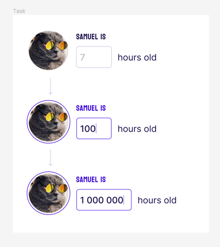

Goal
## Create a numeric input component.

[Figma](https://www.figma.com/file/OcyCt22I1Ha3fgLzGi0ZZy/Front-end-UI-Task?type=design&node-id=1-4&mode=design&t=ZzZ3vo84xwZ6uxJF-0)

1. The user should only be able to enter digits.
2. Groups of 3 digits should be separated by spaces ("1442" → "1 442").
3. Starting at a width of 72 px, the input should adapt to the size of the entered value.
4. From the existing input, you need to create a component that you can reuse it in other parts of the
project.

You can modify this project as you see fit to match a "production ready" state
